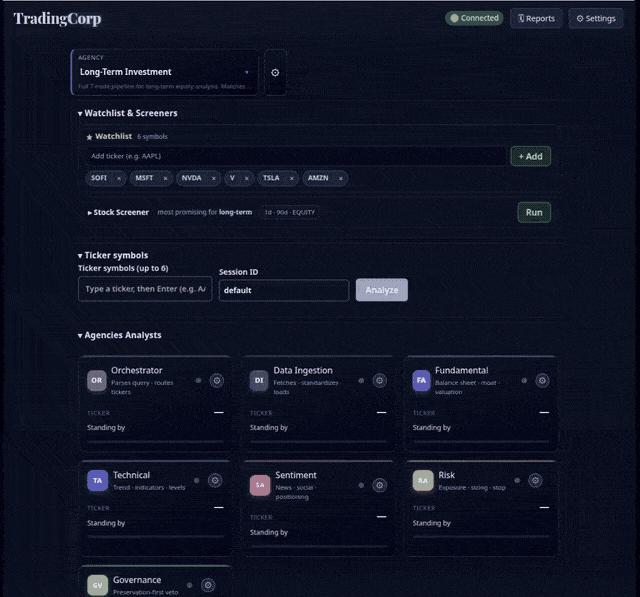
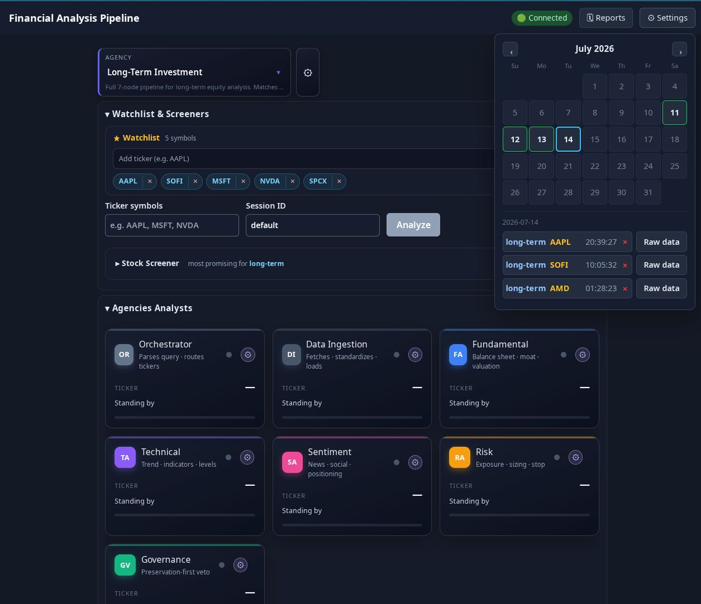

# TradingCorp


Multi-agent AI system for **preservation-first** investment analysis. A backend
orchestrates several specialist agents (fundamental, technical, sentiment, risk)
and a governance gatekeeper, streams their reasoning to the browser in real time
over Socket.IO, and renders the result in a React single-page app.

> Philosophy: capital preservation overrides potential returns. The governance
> gatekeeper can veto any analysis that fails preservation-first criteria.

---

## Table of contents

- [Architecture](#architecture)
- [Tech stack](#tech-stack)
- [Project layout](#project-layout)
- [Quick start](#quick-start)
- [Configuration](#configuration)
- [Analysis request / response contract](#analysis-request--response-contract)
- [Settings dialog & runtime config (Option B)](#settings-dialog--runtime-config-option-b)
- [Analyst Wall & drill-down traceability](#analyst-wall--drill-down-traceability)
- [Auto-connect with retry](#auto-connect-with-retry)
- [Frontend rewrite — phased plan](#frontend-rewrite--phased-plan)
- [Testing](#testing)
- [Known issues](#known-issues)
- [Documentation index](#documentation-index)

---

## Architecture

```
┌────────────────────────┐      Socket.IO (real-time)    ┌────────────────────────────┐
│  React + Vite SPA      │  ───────────────────────────▶ │  Express + Socket.IO       │
│  (frontend/)           │  request_analysis / config    │  server (src/server/)      │
│  - AnalysisForm        │  request_analysis / config    │  FinancialAnalysisGraph    │
│  - ResultsPanel        │                               │  (LangGraph orchestration) │
│  - RelationsGraphView  │  ◀─────────────────────────── │                            │
│  - SettingsDialog      │  analysis_start / complete /  │                            │
└────────────────────────┘                               └────────────────────────────┘
        │                                                          │
        │ POST /config (Option B)                                  ▼
        └─────────────────────────────────────────   Specialist agents → Governance gatekeeper
```

- **Backend**: Express serves the API + Socket.IO transport. The
  `FinancialAnalysisGraph` (LangGraph `StateGraph`) runs the agents
  sequentially — Orchestrator → Data Ingestion → Fundamental → Technical →
  Sentiment → Risk → Governance — and the server emits a **normalized**
  `analysis_complete` payload (real `decision` / `confidence` / `reasoning`,
  never `undefined`). During a run it also streams per-analyst progress
  (`analyst_start` / `analyst_done`) that drives the **Analyst Wall**, and
  attaches a structured `analystTraces` array used by the **drill-down drawer**.
- **Frontend**: a Vite-built React SPA under `frontend/`. In dev, Vite proxies
  `/socket.io`, `/config` and `/api` to the backend on `:3001`. In production the
  backend serves the built `frontend/dist`. On load the app **auto-connects** to
  the backend, retrying up to 3 times (countdown shown in the Connect button)
  before giving up and letting the user intervene.

See [`docs/ARCHITECTURE.md`](docs/ARCHITECTURE.md) for the full data-flow and
LangGraph state schema.

## Graphify (code knowledge graph for AI agents)

To cut the tokens an LLM agent spends re-reading the codebase, the repo ships a
[Graphify](https://graphify.com/) knowledge graph. It statically parses the code
(on-device, 36 languages, no telemetry — safe for the encrypted credential
vault) into a typed graph and serves it over MCP so an agent retrieves only the
relevant subgraph for a task instead of grepping/dumping whole files.

- **Build / refresh:** `npm run graphify` — code-only AST extract + clustering
  into `.graphify/` (no LLM key needed). To also index the Markdown docs, set an
  LLM key (`GOOGLE_API_KEY` / `ANTHROPIC_API_KEY` / `OPENAI_API_KEY`) and run
  `npm run graphify:docs`. Requires `pip install "graphifyy[mcp]"` (the `[mcp]`
  extra is needed to run the server).
- **Query it:** `.mcp.json` at the repo root already points an MCP client at
  `.graphify/graph.json` (`python -m graphify.serve`). On the deploy host, change
  the `command` to the host `python` (with `graphifyy[mcp]` installed) or run
  `graphify install` to auto-wire assistants. CLI equivalents: `graphify explain
  "<symbol>"`, `graphify query "<question>"`, `graphify affected "<symbol>"`.
- **Git:** `.graphify/graph.json` + `.graphify/GRAPH_REPORT.md` are committed
  (shareable, so teammates skip re-indexing); `cache/`, `graph.html` and the rest
  stay gitignored.
- **Measured impact:** orienting on a symbol (e.g. `resolveLiveOptionsBundle`)
  returns file+line + traced connections in ~180 tokens vs ~462k tokens to read
  the whole corpus — a ~2500× saving on that task.
- Full convention + caveats: [`AGENT.md` §10](../AGENT.md).

## Demo

<p align="center">
  
</p>

*Watch the Options Agency screen a watchlist, run an analyst-driven screener, and surface each analyst's work and generated results — all from the dashboard.*

## Screenshots


*Just a preview — Allows you to switch Agencies ( different workflows ), Create Watchlist, 
kick off a stock screener based on selected Agency, Company info, such as charts Quotes,
Options chain, and current news articles. Display of each Analysts work, and the generated Results.
Store the report for later review.

The UI allows you to fully configure the Agency, Analysts, and LLM models used

the top-N most promising tickers for the selected
agency, scored against its analyst composition (promise bar + Tech / Sent /
Mom / Verdict), with a → Analyze hand-off into the analysis tool.*

---

## Tech stack

| Layer        | Choice                                                        |
|--------------|---------------------------------------------------------------|
| Frontend     | React 18 + TypeScript, built with **Vite 5**                  |
| Styling      | Tailwind CSS 3 (PostCSS)                                      |
| Real-time    | Socket.IO (client + server v4)                                |
| Visualization (future) | **D3.js 7** (relations graph, added as a dependency now) |
| Backend      | Node.js + Express 4, TypeScript via `tsx`                     |
| Orchestration| LangGraph (`@langchain/langgraph`) `StateGraph`               |
| Tests        | Jest (backend) + Vitest + Testing Library (frontend)          |

---

## Project layout

```
TradingCorp/
├── frontend/                 # React + Vite SPA (new)
│   ├── index.html
│   ├── src/
│   │   ├── main.tsx
│   │   ├── App.tsx
│   │   ├── index.css         # Tailwind entry
│   │   ├── types.ts          # shared types (AnalysisResult, ConnectionSettings, AnalystTrace, …)
│   │   ├── components/       # SettingsDialog, AnalysisForm, ResultsPanel, RelationsGraphView, AnalysisView
│   │   │   └── analysts/     # AnalystWall (real-time per-analyst panels) + AnalystTraceDrawer (drill-down)
│   │   ├── hooks/            # useAnalysis (Phase 3 socket hook) + useAnalystRun (per-analyst streaming)
│   │   ├── api/              # (Phase 2) /config client
│   │   └── test/             # Vitest setup + specs
│   └── dist/                 # production build output (gitignored)
├── src/                      # Backend (TypeScript)
│   ├── server/index.ts       # Express + Socket.IO entry; serves frontend/dist
│   ├── orchestration/        # AgencyGraph builder + buildLegacyGraph shim
│   ├── registry/             # analysts.ts (AnalystDefs) + agencies.ts (AgencyDefs) + logic/*.ts handlers + logic.ts registry
│   ├── nodes/                # generic-analyst.node.ts (the single data-driven node; no per-analyst subclasses)
│   ├── prompts/              # analyst-instructions.ts (TradingAgents-style role prompts for the trace drawer)
│   ├── types/                # financial-analysis.ts (AgentState, InvestmentDecision, AnalystTrace, …)
│   ├── config.ts             # server config (PORT, bindHost, data sources)
│   └── utils/                # logger, retry-handler, parse-query, rng/seed helpers
├── docs/                     # ARCHITECTURE, SETUP, KNOWN_ISSUES, README
├── vite.config.ts            # Vite + Vitest config (root: frontend/, proxies to :3001)
├── tsconfig.frontend.json    # bundler-resolution tsconfig for the SPA
├── tailwind.config.js        # content scans frontend/src
├── postcss.config.js
├── package.json
└── .env.example
```

---

## Quick start

Prerequisites: Node.js 18+ (developed on Node 22), npm.

```bash
# 1. Install dependencies
npm install

# 2. Configure environment (optional — sensible defaults exist)
cp .env.example .env
#   edit .env if you need a non-default PORT / HOST / data-source key

# 3. Run both processes with one command (recommended for local dev)
npm run dev:all
#   → starts the backend (:3001) and Vite dev server (:5173) together via concurrently

# 3b. …or run them in two terminals:
# Terminal 1 — backend (Socket.IO + REST on :3001)
npm run server

# Terminal 2 — Vite front-end (on :5173, proxies /socket.io and /config to :3001)
npm run dev

# 5. (Optional) production build + serve
npm run build      # builds frontend/dist
npm run start      # builds then launches the backend, which serves frontend/dist
```

Open http://localhost:5173. The app **auto-connects** on load (up to 3 retries,
shown as a countdown in the Connect button). Enter a ticker (e.g. `AAPL, MSFT`),
run the analysis, and the Analyst Wall streams each agent's progress live. Once a
run completes, click any analyst panel to open the **drill-down trace drawer**.

---

## Configuration

Server configuration lives in [`src/config.ts`](src/config.ts) and is overridable
via environment variables (template: [`.env.example`](.env.example)).

| Variable                   | Default            | Purpose                                                        |
|----------------------------|--------------------|----------------------------------------------------------------|
| `PORT`                     | `3001`             | Backend HTTP / Socket.IO port                                  |
| `HOST`                     | `localhost`        | Display name in logs                                           |
| `SOCKET_ORIGIN`            | `http://localhost:3000,http://localhost:3001,http://localhost:5173` | Socket.IO CORS allowed origins (comma-separated list, or `*` for any). The Vite dev origin `:5173` is included by default. |
| `DEFAULT_ANALYSIS_DEPTH`   | `STANDARD`         | `QUICK` \| `STANDARD` \| `DEEP`                                |
| `DEFAULT_TIME_HORIZON`     | `MEDIUM_TERM`      | `SHORT_TERM` \| `MEDIUM_TERM` \| `LONG_TERM`                  |
| `DEFAULT_RISK_TOLERANCE`   | `MODERATE`         | `CONSERVATIVE` \| `MODERATE` \| `AGGRESSIVE`                  |
| `LOG_LEVEL`                | `info`             | Logging verbosity                                              |
| `ALPHA_VANTAGE_API_KEY`    | _(empty)_          | Reserved for future data-source integration (not yet consumed)|

**Binding note:** the server binds to `0.0.0.0` (all interfaces) by default via
`bindHost`. If `HOST` is an unresolvable hostname (e.g. `linux-1sou.AtHome` on a
different machine) the bind falls back to `0.0.0.0` so `server.listen()` doesn't
throw `ENOTFOUND`. Logs still show the configured `HOST` name.

> Runtime connection settings (backend **URI** and **access token**) are NOT set
> here — they are supplied at runtime through the in-app **Settings dialog**
> (see below). This keeps secrets out of `.env` and lets the user point the UI at
> any backend instance.

---

## Analysis request / response contract

**Client → server** (`request_analysis` over Socket.IO):

```ts
{ tickers: string[], options: { depth, time_horizon, risk_tolerance } }
```

**Server → client** events:

| Event                | Payload                                   |
|----------------------|-------------------------------------------|
| `welcome`            | `{ message, serverId, timestamp }`        |
| `analysis_start`     | `{ tickers, timestamp, message }`         |
| `analyst_start`      | `{ analyst, ticker, task }`               |
| `analyst_done`       | `{ analyst, ticker, progress, status }`   |
| `analysis_complete`  | normalized `AnalysisResult` (see below)   |
| `analysis_error`     | `{ error, timestamp }`                    |

The `analyst_start` / `analyst_done` events stream per-analyst progress and drive
the **Analyst Wall** (one panel per analyst that fills/shimmers as the run
streams). The `analysis_complete` payload is **normalized** by the server so the
UI never sees `undefined`. It carries the standard result fields plus an
`analystTraces` array:

```ts
{
  decision: 'APPROVE' | 'REJECT' | 'ERROR',
  confidence: number | null,
  reasoning: string,
  preservation_rationale: string | null,
  conditions: string[],
  tickers: string[],
  company_name: string,
  investment_thesis: string,
  final_decision: string,
  error: string | null,
  fundamental_analysis: any | null,
  technical_analysis: any | null,
  sentiment_analysis: any | null,
  risk_assessment: Record<string, any> | null,
  decisions: Record<string, any>,
  riskAssessments: Record<string, any>,
  analystTraces: AnalystTrace[]   // per-analyst drill-down records (see below)
}
```

Each `AnalystTrace` documents how that analyst reached its output:

```ts
interface AnalystTrace {
  analyst: AnalystId;          // 'orchestrator' | 'fundamental' | 'technical' | 'sentiment' | 'risk' | 'governance'
  name: string;
  instructions: string;        // TradingAgents-style role prompt it ran under
  inputs: { ticker: string; label?: string; data: Record<string, any>; sources: string[] }[];
  weighting: { label: string; weight: number; inputs: string[]; contribution?: number; scale?: string; rationale: string }[];
  output: { verdict?: string; score?: number; summary: string; details?: any };
  notes?: string[];
  timestamp: string;
}
```

The rich `InvestmentDecision` (with `confidence`/`reasoning`) is extracted from
the governance node's output message on the server side — this is what fixes the
historical "REJECTED (undefined% confidence)" bug.

---

## Settings dialog & runtime config (Option B)

The user asked for a **Settings dialog** to supply any **URI**, **access-token**,
or other required information, and chose **Option B**: the settings are posted to
a backend `POST /config` endpoint and the backend reads them at analysis time
(per-session, in-memory — not persisted to disk).

- **`ConnectionSettings` model** (`frontend/src/types.ts`):
  ```ts
  { baseUri: string; accessToken: string; extra: Record<string, string> }
  ```
- The dialog (Phase 2) collects the backend base URI, access token, and free-form
  extra fields, then `POST`s them to `/config`.
- The backend stores them in memory and applies them when handling
  `request_analysis` (e.g. targeting the configured `baseUri`, attaching the
  `accessToken` to upstream data-source calls). The token is **never logged** and
  **never embedded in the client bundle**.

> Option B (vs. passing settings on the Socket.IO handshake) keeps the UI a clean
> config surface and lets the same backend serve multiple frontends with
> different runtime config.

---

## Analyst Wall & drill-down traceability

The dashboard shows an **Analyst Wall** — one framed panel per analyst (Orchestrator,
Fundamental, Technical, Sentiment, Risk, Governance). While an analysis runs, the
backend streams `analyst_start` / `analyst_done` events and each panel shimmers and
fills to show the analyst currently working on each ticker.

After a run completes, **click any analyst panel** (it becomes clickable once its
trace is available) to open a **right-side slide-in drawer** (not a modal) with
four drill-down pillars:

1. **Instructions** — the selected **flavor's** Role & Instructions the analyst
   ran under. After you edit + save a flavor in the settings dialog, this tab
   shows the **live saved text immediately** (tagged with a green "● live" badge)
   — no re-run required.
2. **Data Received** — expandable per-ticker rows showing the exact inputs, with
   the source(s) that fed each row.
3. **Weighting → Output** — visual weighting bars plus the per-step logic
   (input → weight → contribution) that produced the analyst's verdict/score.
4. **Sources** — a flat list of every source consulted.

Each analyst card also shows a single **⚙ gear** (→ `✓` once fully configured)
that opens a **tabbed** `AnalystSettingsDialog` (`[Sources]` `[Role & Instructions]`
`[Weights]`).

**Breadcrumb traceability:** from the Weighting tab you can click any input name
(e.g. `debt_to_equity`) and the drawer jumps to the Data tab and highlights the
exact source field it drew from — a clickable `analyst › ticker › field` path at
the top of the drawer lets you trace any output value back to its origin. An
in-drawer analyst switcher lets you move laterally between analysts without closing.

> The trace data is captured from each analyst handler's output (see `captureTrace()`
> in `makeNodeSurface()` — `src/registry/logic/shared.ts`). Because the analysis
> currently runs on **mock/seeded data** (see KNOWN_ISSUES #2), the numbers are
> illustrative — but the capture wiring is real and will carry live inputs once
> real data sources are wired in. The **Quote panel** below the form, however, is
> already live (Yahoo, tokenless).

---

## Stock Screener

The **Stock Screener** sits above the market row and finds the **top-N most
promising tickers for the currently selected agency**, fast (LLM-free). It is
driven by `GET /screener?agencyId=&limit=&universe=` and
`src/registry/logic/screener.ts`.

**How it scores.** Each candidate is scored on **cheap, LLM-free signals
only** — technical / momentum / volatility derived from price bars
(`fetchPriceBars`) and news sentiment (`fetchCompanyNews` + `scoreHeadline`).
The blend is weighted by **which analysts the selected agency actually
contains** (`resolveAgencyWeights`), so a crypto agency leans on
sentiment/onchain while a long-term equity agency leans on technical +
fundamental + sentiment. A bounded-concurrency pool (6 in-flight) keeps it
quick.

**Real data, honest badge.** The candidate universe is pulled **live** from the
NasdaqTrader listed-directory (~13k symbols; `UNIVERSE_PROVIDER=sp500` switches
to a Wikipedia/CSV S&P 500 list). Per-ticker price bars come **live from Yahoo
(tokenless, delayed ~15–20 min)**, falling back to `mock` bars only when the
chart endpoint is throttled. The screen result carries a
**semantically honest badge** — it is *not* a UI bug when it reads `DELAYED`:

| Badge | Meaning | When |
|-------|---------|------|
| `LIVE`  | Real universe + every row on live bars | Reserved for a future sub-second feed |
| `DELAYED` | Real universe; some rows on mock bars | **Normal case.** Shows `N/M live` sub-count |
| `MOCK` | Universe fell back **and** zero live rows | Only when no live source is reachable at all |

A **Data lineage** block under the table shows the universe pipeline
(listed → parsed → pre-filtered → final pool, with source + `LIVE`/`CACHE`/`FALLBACK`
origin badge) and warns **only** when the universe genuinely fell back. The
**Promise** column is a stacked bar / number / top-axis label; the **Run**
button shows a **live running timer** during the 30–40s screen; and a **field
legend** explains every column (Promise / Tech / Sent / Mom / Verdict). Click
any column header to sort. Each row has a **→ Analyze** button that sends the
ticker straight into the analysis tool.

See [`docs/openapi.json`](docs/openapi.json) (`GET /screener`) for the full
response schema, and the Phase 18 row in the phased plan above for the
root-cause fixes (Yahoo 429 retry + circuit-breaker, Nasdaq parser guards).

---

## Auto-connect with retry

On load the app attempts to connect to the Socket.IO backend automatically — this
covers the "refresh the UI" case. It tries **up to 3 times**: each attempt gets a
~4s timeout, and the **Connect button shows a live countdown** (`Connecting… (3)`
→ `Connecting… (2)` → `Connecting… (1)`). On the first successful connection it
settles to `Connected` and the button reads `Connect` (disabled). If all three
attempts fail it shows **`-FAILED-`** and waits for the user to click to retry
manually. Socket.IO's own internal reconnection is disabled so the countdown is
deterministic and visible (the retry loop is owned by `App.tsx`).

---

## Frontend rewrite — phased plan

The original repo had **two** frontends — a raw vanilla `public/index.html` and a
partial Next.js app — neither wired to a clean build. It was rewritten to a single
**React + Vite SPA** delivered in phases, each verified (build + unit tests)
before the next begins.

| Phase | Scope | Status |
|-------|-------|--------|
| **1** | Vite + React + TS scaffold; Tailwind; `tsconfig.frontend.json`; smoke tests. **Build green, tests green.** `package.json` cleaned (removed `next`, vanilla `public/`, `src/pages`), server now serves `frontend/dist`. | ✅ Done |
| **2** | `SettingsDialog` component + backend `POST /config` (Option B) + unit tests. | ✅ Done |
| **3** | Core analysis UI: `AnalysisForm`, normalized `ResultsPanel`, streaming `useAnalysis` hook over `analysis_start`/`analysis_complete`/`analysis_error` + unit tests. | ✅ Done |
| **4** | Clean visualization class structure + **D3** `RelationsGraph` (real nodes/edges render, wired via `RelationsGraphView`) + unit tests. | ✅ Done |
| **5** | Final wiring/verify + docs sync. (SPA serving done in Phase 1; all phases complete and tested.) | ✅ Done |
| **6** | **Analyst Wall** (real-time per-analyst panels driven by `analyst_start`/`analyst_done`) + **drill-down trace drawer** (slide-in, 4 pillars: Instructions / Data / Weighting→Output / Sources) with breadcrumb traceability back to source fields. Backend `analystTraces` captured per node (`captureTrace`) and shipped on `analysis_complete`. | ✅ Done |
| **7** | **Auto-connect with retry** — app connects on load, up to 3 attempts with a live countdown in the Connect button (`Connecting… (3→2→1)`), then `-FAILED-` awaiting manual retry. Socket.IO internal reconnection disabled so the countdown is deterministic. | ✅ Done |
| **8** | **Per-analyst tabbed settings dialog** — each analyst card shows ONE ⚙ gear opening a tabbed `AnalystSettingsDialog` (`[Sources]` `[Role & Instructions]` `[Weights]`); the former two-gear design + `AnalystSourceDialog` were removed. Role & Instructions edits show **live** in the trace drawer immediately (no re-run). | ✅ Done |
| **9** | **Live market data (Phase 3)** — after a symbol is entered, tokenless `GET /quote` (Yahoo) surfaces company name + price + day/52-week range + volume, `GET /history` surfaces OHLCV bars, and `GET /options-history` (Polygon, keyed) surfaces option chains. Each degrades to a `note` on source failure. Verified live (AAPL, MSFT). | ✅ Done |
| **10** | **Unified market card (Phase M)** — replaced the three separate `QuotePanel` / `HistoryPanel` / `OptionsChainPanel` rows with a single **`MarketDataCard`** per ticker (`Chart` / `Quote` / `History` / `Options` tabs). The Chart tab renders a D3 candlestick + volume chart (custom `PriceChart`, TradingView-style crosshair + hover tooltip) with 1D/5M/1M interval toggles. Orphaned panels + their tests deleted. | ✅ Done |
| **11** | **Real-data technical verdict (2.1)** — the Technical Analyst is now fully data-driven from real Yahoo OHLCV bars: trend / momentum / volatility / support-resistance / score are *derived* from price history (SMA stack, higher-highs/lows, RSI+MACD, return volatility, swing S/R, max drawdown). The seeded RNG is now a **no-bars fallback only**, not mixed into live runs. Ingestion now honors the horizon profile (real 5m/1m bars for intraday/medium, not a hardcoded 1y/1d). Trace `notes` honestly report "derived from real Yahoo OHLCV bars" vs "seeded fallback". 8 new unit tests (`src/tests/technical-realbars.test.ts`). | ✅ Done |
| **12** | **Analysis-grade chart (item 3)** — `PriceChart` is no longer decorative: it computes **client-side** SMA 20/50/200, EMA 12/26, Bollinger Bands (20,2), VWAP, and RSI(14) overlays from the bars it already has, each toggleable. RSI renders as its own 0–100 sub-pane (30/50/70 guides). The **technical analyst's `support_resistance` levels are plotted as dashed green (support) / red (resistance) annotation lines** with right-axis labels, bridging the *real* chart to the *analyst's* conclusions. `AnalysisView` threads `result.technical_analysis[symbol]` into `MarketDataCard`; a `SMA/EMA/BB/VWAP/RSI` studies toggle row drives visibility. Wheel-zoom + crosshair + tooltip preserved (tooltip shows hovered indicator values). | ✅ Done |
| **13** | **Live news + sentiment feed (item 4)** — a real **News / Sentiment** tab in `MarketDataCard`: `GET /news?symbol=` (new `news-routes.ts`) pulls **Finnhub `/company-news`** headlines (tokenless after a free `FINNHUB_KEY`) and scores each with a **deterministic keyword-polarity model** (no LLM — auditable, free). When Finnhub is reachable, `data-ingestion.ts` overrides `sentiment_data[ticker]` with the real news score + `key_news`, so the **Sentiment Analyst's existing `realSent` hook fires** and turns its seeded verdict into a real one (zero analyst-code changes). The tab shows the real headline list (title / source / time / polarity chip) + aggregate sentiment, and — after an analysis run — the **Sentiment Analyst's own scored read** (news/social/analyst/institutional breakdown) threaded from `result.sentiment_analysis[symbol]`. Degrades to a shaped seeded headline set when no key/network. 9 backend + 2 frontend new tests. | ✅ Done |
| **14** | **Comparable / multi-ticker analysis (item 5)** — a **Compare** toggle appears above the market-row when 2–5 tickers are in the current run. Compare mode replaces the per-ticker cards with a centerpiece `CompareView`: (1) a **normalized relative-performance chart** (each ticker rebased to 100, overlaid SVG lines + legend), (2) a **pairwise return-correlation matrix** (Pearson, color-coded green/red), and (3) a **side-by-side verdict table** (technical score/verdict + sentiment score per ticker, sourced from `result.technical_analysis[symbol]` / `sentiment_analysis[symbol]`). Price series are fetched live via `GET /history` (real when reachable, shaped mock otherwise) — same degradation pattern as the other market cards. Pure helpers in `compareUtils.ts` (normalizeToBase / dailyReturns / pearson / correlationMatrix / alignTail) are unit-tested with injected bars. 12 + 3 new tests. | ✅ Done |
| **15** | **Stock Screener (item 6)** — `GET /screener?agencyId=&limit=&universe=` returns the **top-N most-promising tickers for the currently selected agency**, fast. `src/registry/logic/screener.ts` scores a candidate universe against the **agency's actual analyst composition** (derived axis weights from `agencies.ts`) using only **cheap, LLM-free signals**: `fetchPriceBars` (technical / momentum / volatility) + `fetchCompanyNews` / `scoreHeadline` (sentiment). A **bounded-concurrency pool (6 in-flight)** keeps it quick; the response includes `elapsedMs` + per-axis scores + a `topAxis` tag so the UI can label *why* each ticker ranked. Frontend `ScreenerPanel` sits above the market-row with a **Run** button, a top-N table (promise bar + tech / sentiment / momentum / verdict), an **elapsed-time readout**, and a **→ Analyze** button that sends the pick straight into the analysis tool. | ✅ Done |
| **16** | **Watchlist / Portfolio layer (item 7)** — the persistent "my tickers" home. `src/lib/watchlist.ts` is an SSR-safe `localStorage` store with a reactive `useWatchlist()` hook (module-level pub/sub keeps every consumer in sync). `WatchlistBar` renders above the form so returning users land on a **portfolio view** (saved-symbol chips + add input), not a one-shot form; clicking a chip **deep-dives** through the analysis tool (`MarketDataCard`), and a × removes it. `MarketDataCard` gained a **watch star** (controlled `watched`/`onToggleWatch` props, falling back to the shared store when uncontrolled) so starring a market card promotes it into the watchlist — closing the loop between one-shot research and a saved portfolio. | ✅ Done |
| **17** | **Options Greeks in the Options tab** — each option quote now carries **Black–Scholes greeks (Δ/Γ/ν/Θ/ρ)** re-derived from its implied volatility (`bsGreeks` in `src/registry/logic/greeks.ts`, already the project's single pricing source of truth). `GET /options-history` now returns a `greeks[]` array (one row per quote, computed for both the live Polygon chain and the mock fallback — so Greeks show even with no key/network). `MarketDataCard`'s Options tab renders a **separate per-strike Greeks subtable** (Call/Put side, Δ/Γ/ν/Θ/ρ) below the Call/Put table; vega is shown per 1 vol-point (ν/100) and theta per day (Θ/365), with a footnote explaining the scaling. No new data provider required. | ✅ Done |
| **18** | **Real-data Stock Screener (truthful badge + UI)** — the screener now sources a **LIVE tradable universe** (NasdaqTrader listed directory, ~13k symbols; `UNIVERSE_PROVIDER=sp500` switches to a Wikipedia/CSV S&P 500 list) instead of a hardcoded 25-ticker list. Per-ticker price bars are pulled **live (Yahoo, tokenless, delayed ~15–20 min)** with a `mock` fallback only when the chart endpoint is throttled. The result carries a **semantically honest data-source badge**: `LIVE` (real universe + all live bars), `DELAYED` (real universe, some rows on mock bars — shows an `N/M live` sub-count), or `MOCK` (universe fell back AND zero live rows). A **Data lineage** block shows the universe pipeline (listed → parsed → pre-filtered → final pool, source + origin badge) and warns only when it genuinely fell back. The Promise column renders a **stacked bar / number / top-axis label**, the Run button shows a **live running timer** (e.g. `Screening… 12.3s`) during the 30–40s screen, and a **field legend** explains each column. Backend root-causes fixed: listed-reference crash, Nasdaq parser guards, Yahoo 429 retry + circuit-breaker after 2 empty batches, Wikipedia retry, live-unpriced fallback pool. 18 new backend universe tests + 12 frontend `ScreenerPanel` tests. | ✅ Done |
| **19** | **API docs served same-origin + dynamic server host** — `GET /api-docs` (Swagger UI v5, dark mode) is served by the Express backend at runtime from `docs/openapi.json`; **not** generated at build time. The "View API docs" button now opens the **SPA's own origin** `/api-docs/` (proxied by Vite in dev, same origin in prod) instead of the Settings **Backend URI** (which pointed at `localhost:3001` and was unreachable on a LAN host). The served spec's `servers` entry is **rewritten from `HOST`/`PORT` env at request time** (falls back to `localhost:3001` when unset), so Swagger UI's "Servers" line matches how the server was actually started (e.g. `http://10.9.200.188:8091`). 3 new backend `api-docs-routes.test.ts` cases. | ✅ Done |
| **20** | **Rebrand to TradingCorp** — every user-visible "Financial Analysis Pipeline" string is renamed to **TradingCorp** (app header `<h1>`, browser tab title, Swagger UI title, Socket.IO "Connected to…" message, OpenAPI `title`/`description`/`contact`, report PDF/HTML footers, both README headings, analyst-guide HTML, docs dir references). Package identity (`package.json` + `package-lock.json` `name`) → `tradingcorp`; the news fetch User-Agent and the Vite config comment updated to match. The internal LLM-vault crypto salt is intentionally **left unchanged** (renaming it would break decryption of saved credentials). | ✅ Done |
| **21** | **Screener Timeframe + Instrument inputs (Phase 3)** — the Stock Screener panel gained two controls above Run: a **Timeframe** dropdown (5m / 1m / 90d / 1d / Auto) that maps to real `(interval, lookbackDays)` presets the backend's `fetchPriceBars` supports (no fake weekly/monthly bars), where an explicit preset overrides the agency horizon and `Auto` defers to `resolveScreenerProfile`; and an **Instrument** dropdown (Auto / Equity / Option) that resolves to the agency's declared instrument (`Auto` reads the option agencies' `OPTION`, else `EQUITY`), is sent to `GET /screener?instrument=` and reflected on the result with an honest `OPTION-LISTED` badge + note. Backend `screenTickers` now accepts/reflects `instrument`; the frontend `agencies.ts` mirror was corrected to actually carry `instrument: 'OPTION'` on the two options agencies (was a description-only mention — a latent mirror drift). 9 + 4 new frontend tests, 2 new backend tests. | ✅ Done (superseded by 22) |
| **22** | **Screener horizon + asset class as agency-level defaults** — the per-run Timeframe/Instrument selects from Phase 21 were **removed**; horizon and instrument are now properties of the *agency*, not a per-run pick. Each `AgencyDef` carries three explicit, editable fields — `assetClass` (`EQUITY`/`OPTION`/`CRYPTO`), `screenerInterval` (`1m`/`5m`/`1h`/`4h`/`1d` — **1h/4h added**, each with a real bar generator in `hist.ts`: 1h step 3.6M ms, 4h step 14.4M ms, vwap present, count capped 390), and `screenerLookbackDays`. `resolveScreenerProfile(agencyId, agencyDef?)` merges explicit fields over per-category defaults (long/medium → EQUITY 1d/90d; intraday → EQUITY 5m/5d; crypto-screener → CRYPTO 1d/90d; options-swing → OPTION 1d/90d; options-intraday → OPTION 5m/5d). The three fields are edited on a **single row** in the Agency settings dialog and persisted via `PUT/POST /registry/agency`. The Stock Screener header shows the resolved profile as an **inline badge** `most promising for <agency> [interval · lookbackDays · assetClass]` that recomputes on agency switch. `CRYPTO` is selectable but honestly labelled "universe source TBD" (not yet screenable). See `docs/SCREENER_STANDARDS.md §8`. New backend profile-override + instrument + 1h/4h history tests; frontend Phase-22 panel + badge-switch tests. | ✅ Done |
| **23** | **LLM model config no longer wiped by partial writes** — root-caused a bug where `.data/llm-config.json` could silently lose a role (e.g. `scanner`) and never recover it. Cause: `LlmConfigStore` held all 3 roles in memory but `JsonLlmStore` only persisted roles it had explicitly seen; once the on-disk file lost a role (older full-replace POST, or a stale client sending a partial `configs` array), every subsequent save re-flushed only the known subset, so the missing role stuck. Fix (`src/server/llm-config.ts`): (1) **self-heal on load** — the store re-seeds any canonical role missing from disk from defaults and writes it back; (2) **complete writes** — `put()` now persists **all** roles, so a single-role save (or partial POST) can never clobber the others. User selections are preserved (gaps filled, never overwritten). 2 new regression tests in `llm-config.test.ts`. | ✅ Done |
| **24** | **Crypto agency hidden (deferred, hooks kept)** — the `crypto-screener` agency is **hidden from the selectable dropdown by default** because its real data sources (crypto universe provider + on-chain net-flow/active-address metrics) don't exist yet; shipping it now would be either fake data (violates the honest-labeling standard) or equity-in-disguise. Rather than delete it, `AgencyDef` gained a `hidden?: boolean` flag; `crypto-screener` sets it, the backend `/registry` list omits `hidden` agencies unless `ENABLE_CRYPTO_AGENCY=true`, and the frontend `AgencySelect` filters them. **All hooks stay intact**: the `onchain` analyst (declarative, LLM-free), `CRYPTO` asset-class enum, the resolver, and the existing `crypto-screener.test.ts`. Re-enabling later is a one-env-flag flip, no rework. 2 new backend tests (hidden-by-default + revealed-with-env). | ✅ Done |
| **25** | **Live data-source integration + honest provenance** — the ingestion path now consumes **live inputs** instead of pure seeded demo data: Yahoo price/history/quote (tokenless), Alpha Vantage `OVERVIEW` fundamentals (keyed), and Finnhub `company-news` sentiment (keyed) each override their seeded block when reachable, via `fetchRealFinancialData`. Options ingestion targets **Massive/Polygon** (`api.massive.com`, Bearer) when entitled. Every domain reports a per-source provenance (`live`/`seeded`/`yahoo`/`polygon`/`cboe`) in `data_quality.sources` and the analyst trace notes, and the Results banner "MOCK — no live source" is gated on `dataHealth.sourcesOk === 0` (no false MOCK while live sources are green). Credentials live in the encrypted LLM vault (Settings dialog), not `.env`. | ✅ Done |
| **26** | **CBOE free option-chain fallback + honest badges** — when Massive returns 401/403 (entitlement) or no key is set, `fetchOptionChain` falls through to the **free CBOE delayed feed** (`cdn.cboe.com/api/global/delayed_quotes/options/{TICKER}.json`, no key, UA Mozilla) — real bid/ask/iv + per-contract greeks, delayed ~15–20 min. `resolveLiveOptionsBundle` wires it into `options_ingestion` and the vol-surface / pricing / greeks / flow / risk side-panes, so those analysts compute on **real** delayed quotes. Source badge is honest: `LIVE` (Massive entitled) / `DELAYED` (CBOE) / `MOCK`; the RawDataDrawer provenance label + the small **orange** `.quote-warn` MOCK note reflect the true reason (e.g. "Massive key configured but live call returned 401"). Verified live (NVDA/AAPL/TSLA/SOFI). | ✅ Done |
| **27** | **Correct options greeks (CBOE feed, real spot, decimal IV)** — root-caused delta pinning to ±1.0: the chain parser used a **median-strike heuristic as spot** and divided CBOE's already-decimal IV by 100. Fix (`parseCboeOptions` in `hist.ts`): read the real underlying from CBOE `current_price`, use CBOE's own Δ/Γ/ν/Θ/ρ directly (BS `bsGreeks` only as a per-field fallback), treat `iv: 0` as missing (fallback 0.3). A dedicated **BS-vs-CBOE parity test** (`src/tests/greeks-cboe-parity.test.ts`) validates our derived greeks against the real feed on a captured fixture (`fixtures/cboe-nvda-greeks.json`) plus an opt-in live layer (`RUN_LIVE_CBOE=1`); tolerances are mean + 95th-percentile (delta p95 ≈ 0.022) to avoid flaky live outliers, excluding 0–2 DTE. | ✅ Done |
| **28** | **No-run chart preview (watchlist click / ticker blur)** — clicking a **Watchlist** chip or leaving the **Ticker symbols** input now fills in and shows the `MarketDataCard` chart **immediately**, without waiting for `[Analyze]`. `AnalysisView` keeps a separate `previewTickers` state (distinct from the run-owned `wallTickers`), validated via `getQuote` — if the symbol can't be resolved, **nothing** is shown (no card, no error). `[Analyze]` still starts the agency run and takes ownership of the card (preview cleared). 4 new frontend tests (chip preview / blur preview / not-found→nothing / Analyze transition). | ✅ Done |

---

## Testing

| Suite        | Command                          | Framework            | Coverage |
|--------------|----------------------------------|----------------------|----------|
| **All**      | `npm test`                       | Jest + Vitest        | both     |
| Backend      | `npm run test:server`            | Jest + ts-jest       | ✓ (`coverage/`) — **~540 tests, 64 suites** |
| Frontend     | `npm run test:ui`                | Vitest + Testing Library | ✓ (`coverage-ui/`) — **322 tests, 39 files**  |

> A handful of backend suites (`llm-config`, `llm-sqlite`, `news`,
> `data-received.r2`, `server-log`) are **environment-gated** — they need a
> writable store path / `LLM_VAULT_PASSPHRASE` / a live news transport and will
> fail in a bare sandbox with no vault or keys. Run them where those are
> configured. All frontend suites and the core backend logic suites are green
> unconditionally.

```bash
npm test            # runs test:server (jest, coverage) THEN test:ui (vitest, coverage)
npm run test:server # backend jest suite + coverage report
npm run test:ui     # frontend vitest suite + coverage report
```

- Backend coverage is configured in `jest.config.js` (`collectCoverageFrom` →
  `src/**/*.ts`, excluding types/tests).
- Frontend coverage is configured in `vite.config.ts` (`test.coverage`, v8
  provider, scoped to `frontend/src`).
- HTML/LCOV reports land in `coverage/` (backend) and `coverage-ui/` (frontend).

---

## Known issues

- The orchestrator's `parseQuery()` still contains hardcoded test strings
  (documented in [`docs/KNOWN_ISSUES.md`](docs/KNOWN_ISSUES.md)).
- The per-analyst **scoring/weighting** logic is still the deterministic model,
  but it now consumes **live inputs**: Yahoo price/history, Alpha Vantage
  fundamentals (keyed), Finnhub news/sentiment (keyed), and a live option chain
  from **Massive/Polygon** (entitled) → **CBOE free delayed feed** (no key)
  before any mock. The unified **`MarketDataCard`** shows real company name,
  price, ranges, volume, a D3 price chart, and a real option chain with
  feed-provided/derived greeks. Provenance is surfaced honestly (LIVE/DELAYED/
  MOCK badges + per-domain source notes); the vol-surface remains a deterministic
  mock.
- Full details and the external-data integration roadmap:
  [`docs/KNOWN_ISSUES.md`](docs/KNOWN_ISSUES.md).
- **AI agents working in this repo: read [`AGENT.md`](AGENT.md) first** — it holds
  the deploy procedure (two-copies gotcha), data-source rules, and the
  semantic-honesty bar.

---

## Documentation index

- [`docs/README.md`](docs/README.md) — project overview + documentation map
- [`docs/ARCHITECTURE.md`](docs/ARCHITECTURE.md) — LangGraph DAG, Socket.IO + SPA flow, node responsibilities
- [`docs/EXTENDING_ANALYSTS.md`](docs/EXTENDING_ANALYSTS.md) — add an analyst/agency (declarative + fn + options paths)
- [`docs/SCREENER_STANDARDS.md`](docs/SCREENER_STANDARDS.md) — Stock Screener selection standards & traceability (how/why it picks tickers)
- [`docs/SETUP.md`](docs/SETUP.md) — install, env table, run scripts
- [`docs/ARCHITECTURE.md §Multi-Source Data Architecture`](docs/ARCHITECTURE.md#multi-source-data-architecture-vendor-agnostic-fan-in) — vendor-agnostic multi-source plan (data domains + adapters + fan-in/weighting; phased rework)
- [`docs/KNOWN_ISSUES.md`](docs/KNOWN_ISSUES.md) — limitations & workarounds
- [`docs/archive/`](docs/archive/) — superseded design docs (historical, kept for traceability)
- **Live REST API docs** — served by the running server at **`/api-docs`** (Swagger UI v5, dark mode). The OpenAPI 3.0 document lives at [`docs/openapi.json`](docs/openapi.json) and is kept in sync with the route handlers. Covers all REST endpoints including `GET /news`, `GET /screener`, and the analyst/agency CRUD endpoints; the Watchlist / Portfolio layer is frontend-only (`localStorage`), so it has no backend endpoint.

---

## License

MIT
